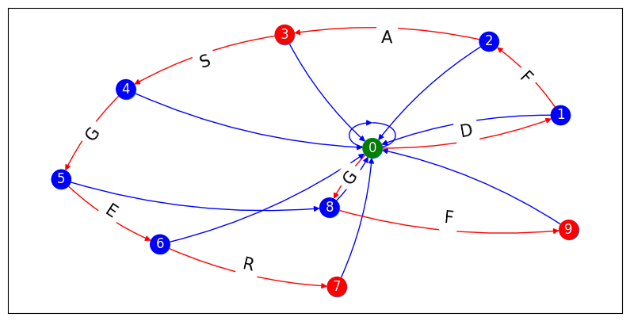

# bioalgorithms-TP2

a popular string-matching algorithm that is mainly meant to seach multiple patterns with one singel itration. 
The Aho-Corasick algorithm constructs a data structure similar to a trie with some additional links.

## How to run it

~~~python
dictaho = aho_parcour('CAGTAACCGTA', ['GTA', 'AGT', 'AAC'])
print(str(dictaho))
~~~

~~~shell
{'AGT': [1], 'GTA': [2, 8], 'AAC': [4]}
~~~

~~~python
dictaho = aho_parcour('TATATTAATT', ['AT', 'TATT', 'TT'])
print(str(dictaho))
~~~

~~~shell
{'AT': [1, 3, 7], 'TT': [4, 8], 'TATT': [2]}
~~~

~~~python
dictaho = aho_parcour('ASDFASGERGFERGF', ['DFASGER', 'DFA', 'GF'])
print(str(dictaho))
~~~

~~~shell
{'DFA': [2], 'DFASGER': [2], 'GF': [9, 13]}
~~~

we can also visualise the constructed finite state machine (automaton) 

~~~python
dictaho = init_aho_autom(['GTA', 'AGT', 'AAC'])
grphe(dictaho)
~~~

~~~python
dictaho = init_aho_autom(['AT', 'TATT', 'TT'])
grphe(dictaho)
~~~

~~~python
dictaho = init_aho_autom(['DFASGER', 'DFA', 'GF'])
grphe(dictaho)
~~~

